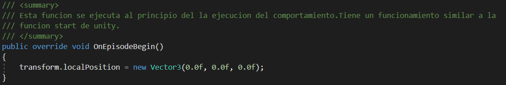
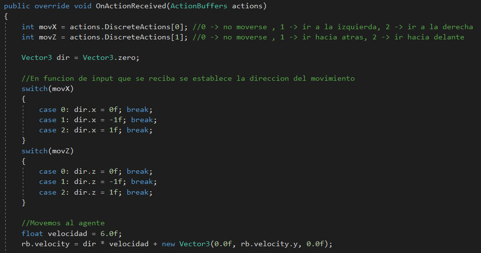

# Aprendizaje automático con ml agents de Unity
Proyecto final de la asignatura de inteligencia artificial para videojuegos. Curso 2020/2021. Alumno: Felipe Cuadra Plaza.

Link de la build -> por hacer

Link del video ->por hacer
____________________________________________________________________________________________________________________________
## _Introducción_

> El plugin de aprendizaje automático o simplemente ML-Agents es un proyecto de código abierto de Unity, que permite que los juegos y simulaciones sirvan como entornos para entrenar a los agentes inteligentes. ML-Agents incluye una biblioteca de última generación para entrenar agentes para entornos 2D, 3D y VR.

>Los agentes pueden ser entrenados usando técnicas como aprendizaje de refuerzo, aprendizaje de imitación (estos dos son los que vamos a ver en este proyecto), neuro-evolución y otros métodos ML a través de una API de Python simple de usar. El plugin incluye una serie de opciones de capacitación, como Curriculum Learning para entornos de recompensa dispersa, auto-juego para escenarios de múltiples agentes y más.

>Estos agentes entrenados pueden ser utilizados para múltiples propósitos, incluyendo controlar el comportamiento de NPCs, pruebas automatizadas durante el desarrolo de juegos, así como evaluar varias decisiones de diseño del juego antes de su lanzamiento.

____________________________________________________________________________________________________________________________
## _Desarrollo del proyecto_
El proyecto consiste en realizar tres comportamientos más o menos simples usando los ML-Agents empleando las técnicas de aprendizaje por refuerzo y aprendizaje por imitación.Primiero de todo voy a explicar en que consiste cada método de aprendizaje.

El **_aprendizaje por refuerzo_** se basa en un bucle que consta de cuatro acciones como se puede ver en la imagen. 

La primera acción es la observación en la que el agente obtiene datos de su entorno de entrenamiento, la segunda es tomar una decisión en función de los datos que tenga, después realiza la acción que tenga que hacer y finalmente si realiza la accion correcta obtiene una recompensa si obtien una penalización. Cos estas acciones, en un continuo bucle el agente, basandose en sus obsevaciones y acciones irá aprendiendo para conseguir las recompensas más altas. En resumen este método se basa en aprender mediante recompensas.

En cambio, el **_aprendizaje por imitación_** consiste en que el agente aprende de lo que un humano hace, es decir, en vez de probar acciones aleatorias (que sería como se aprende mediante refuerzo) va a tratar de imitar lo que he hecho el jugador.Este metodo es más útila cuando se tienen unos entornos más complejos y se requiere un comportamiento algo más difícil.Decir, que también se pueden aplicar recompensas y castigos al agente, para no solo imitar lo que hace el jugador si no también para mejorar esa imitación.

____________________________________________________________________________________________________________________________
## _Guía rápida de instalacion del plugin ML-Agents en Unity_

Por hacer
____________________________________________________________________________________________________________________________
## _Desarrollo de los comportamientos_

Teniendo un proyecto de Unity vacío, cada comportamiento se va a desarrollar en una escena por separado. Decir también que una parte del tiempo dedicado al proyecto se ha empleado en investigar como funciona este plugin y aunque los comportamientos que vamos a hacer no son muy complejos peden servir para tener una buena base para poder hacer un futuro comportamientos más complicados.

### _Primer comportamiento mediante aprendizaje por refuerzo_

Este comportamiento va a ser muy simple pero servirá para aprender lo básico de los ML-Agents de unity. Consiste en que un agente en este caso el cubo azul con ojos tiene que llegar a un objetivo que es la esfera amarilla en este pequeño entorno de entrenamiento rodeado por muros. Decir que la esfera y los muros son triggers y el agente tiene un rigidbody kinemático, ya que se va a mover mediante su transform.

Una vez hecho este escenario voy a añadir al agente una scripts que voy a llamar MoverHaciaObjetivo.cs y hay que hacer que la clase herede de Agent y no de MonoBehaviour, porque toda script que vaya a implementar comportamientos mediante ML-Agents debe heredar de Agent. Despues vamos a agregar dos scripts propias del plugin de ML-Agents que son BehaviorParameters y DecisionRequester.También hay que saber que el algoritmo de machine learning de Unity solo entiende de números, es decir, que no sabe que es ir a la derecha, que es un vector, que es un transform,etc. Vamos a ver algunos de los atributos mas importantes de la primera scripts:

- **Behavior Name**: es el nombre que va a tener el comportamiento
- **Vector observations**: concretamente el Space Size es el número de observaciones que tiene que tener el agente
- **Vector Action**: en el Space Type tiene dos tipos DISCRETE que representa números enteros y CONTINUOUS que representa números decimales. Si tipo es CONTINUOUS el Space Sizee representa el numero de acciones del agente y si el tipo es DISCRETE, Branches Size tambien es el numero de acciones del agente pero además hay que poner cuantos números va a tener cada accion o en este caso rama en los apartados de Branch 0 Size, Branch 1 size,etc.Por eejemplo si en un tamaño de la rama ponermos 2 significa que tiene dos números que son en 0 y el 1.
- **Model**: aqui se agrega un archivo que es como el "cerebro" del agente para que desempeñe su comportamiento.
- **Behavior Type**: hay  tres tipos, DEFAULT que se usa cuando el agente está entrenando, HEURISTIC se usa cuando queremos controlar nosotros al egente para probar el entorno y INFERENCE que se usa cuando el agnte ya tiene un cerebro.

La otra script solicita una decision cada cierto tiempo para llevar a cabo una acción. En esta script los parámetros se pueden dejar como están.

Al asignar la script creada que hereda de Agent en el inspector aparecerá una variable llamada **Max Step** que se refiere a la siguiente actualización en el entrenamiento que por defecto se produce 15 veces por segundo como las físicas de unity, por ejmplo voy a asignarle un valor de 1000. Esto lo pongo para que el entrenamiento tenga un fin por si en algún momento el agente nuca es capaz de llegar al objetivo.
Tras saber esto vamos a empezar a escribir código en la script que se ha creado antes. Lo primero que hago es crear cuatro variables una que almacena la posición del objetivo, otra que guarda el MeshRenderer del suelo para cambiarle el material, ya que voy a hacer que cuando el agnete realize su tarea con éxito el suelo se ponga verde y si fracasa lo pongo rojo. Las otras dos variables son materiales con los colores.

Vamosa empezar por asignar al agente que observaciones tiene que tener en cuenta,para ello vamos a escribir un método de la clase Agente que se llama  CollectObservations(VectorSensor sensor). En este metodos añadiremos todo lo que el agente tiene que tener en cuenta con el método sensor.AddObservation(...). Aqui hay que pensar que es lo que necesita el agente para desempeñar su tarea, en este caso solo necesita saber su propia posición y la posición del objetivo. 

Tras haber puesto esto hay que volver a la script llamada BehaviorParameters y en el apartado de VectorObservation en el Space Size hay que poner 6. Pero ¿por qué 6 y no 2?, ya que solo se han añadido dos obsrvaciones. Como se ha dicho antes los ML-Agents solo entienden números y como las dos posiciones son un vector de 3 números cada uno ,por eso ponemos 6, porque son dos vectores cada uno de los cuales tiene tres números.

También vamos a cambiar en el apartado de Vector Action, en Space Type vamos a poner CONTINUOUS para que el agente tenga en cuenta números decimales y en Space Size vamos a poner 2 porque solo nos interesan dos acciones que son moverse en el eje X y moverse en el eje Z.

A continuacion vamos a que el agente recoja las acciones puestas antes, para ello vamos a utilizar el método OnActionReceived(float[] vectorAction). Aqui solo vamos a hacer 
la primera poscion del vector vectorAction sea para el movimiento en X y la segunda posición del vector que sea para el movimiento en el eje Z. Finalmente vamos a mover al agente mediante su transform.

Lo que nos falta es dar una recompensa o un castigo al agente. La recompensa se la vamos a dar cuando el agente choche con el objetivo y el castigo cuando choque con un muro, para ello vamos a recurrir a la funcion OnTriggerEnter de Unity. También vamos a recurrir a dos funciones de la clase Agent que son setReward(...) y EndEpisode(). La primera función sirve para establecer una recompensa o un castigo, dependiendo de si el número es positivo o negativo y la segunda sirve para finalizar el comportamiento. También cambio el color del suelo.

También ha que resetear el entorno cada vez que se empiece el comportamiento de nuevo, para ello recurrimos a una función que hereda de Agent llamada OnEpisodeBegin() que de momento solo va a hacer que el agente se coloque en el centro del escenario, el objetivo de momento va a estar siempre en la misma posición.

Por último hay que poder probar este entorno que hemos programado y creado por lo que vamos a añadir otra función que hereda de Agent llamada Heuristic(float[] actionsOut), que recoje el input del usuario que se va a enviar a la función OnActionReceived(float[] vectorAction). Las dos acciones las asignamos con el metodo getAxisRaw(...) de Unity para el movimiento en X y en Z.

Para poder probar el entorno hay que ir de nuevo a la script llamada BehaviorParameters y en el apartado de Behavior Type hay que poner HEURISTIC que ya deberías saber que signica esto. Ya solo queda darle al botón play de Unity y debería poder mover al agnete con las teclas W,A,S,D y si choca con el objetivo o con un muroseu posición se resetea al centro del entorno. Una vez que esto funcione correctamente podremos entrenar a nuestro agente.

Para entrenarlo hay que abrir la consola de windows en el directorio raíz del proyecto de Unity y activar el entorno virtual de pyhton. Una vez que se ha hecho esto hay que escribir el siguiente comando. 

- **mlagents-learn** es el comando que se encarga de entrenar
- **--run-id=nombre** es el nombre que le quieras dar a la carpeta que tendrá todos los archivos relacionados con el entrenamiento. Esta carpeta asu vez se guarda en una carpeta llamada results que está en el directorio raíz del proyecto de Unity
- **--force** no es obligatorio ponerlo pero si quieres hacer varios entrenamientos con el mismo nombre tienes que poner esta opción para que sobreescriba los archivos que había antes, si no también puedes poner un nombre diferente a cada entrenamiento que hagas.

Una vez ejecutado este parametro hay que cambiar el Behavior Type a DEFAULT y pulsar el botón del play de Unity y el agente se debera mover por si solo e intentará llegar al objetivo,como se puede ver en este [vídeo](https://drive.google.com/file/d/1nNEVJmDRaxbXNb82eXXHFGjbxX3CHiUZ/view?usp=sharing).Para salir del entrenamiento basta con pararla ejecución del Unity. Pero igual se tarda bastante en enseñar al agente si solo tenemosun entorno de entranmiento, para que vaya más rápido voy a duplicar el entorno y voy a hacer 20 y voy a volver a ajecutar el comando de antes y como se puede ver en este [vídeo](https://drive.google.com/file/d/1e1uKbA2j8SJMKIkldEv5OjAeXa3H2s4r/view?usp=sharing) ahora hay 20 agentes entrenando a la vez. También decir que cuanto más tiempo dejes entrenando al agente más rápido y mejor hará su tarea. Como puedes ver al principo no muchos consiguen llegar al objetivo pero con el paso del tiempo el agente va aprendiendo y al final del video todos los agentes son capaces de llegar al objetivo. Después solo dejo activado un entorno de entrenamiento.

Una vez entrenado vamos a hacer que agente use todo lo que ha aprendido durante su entrenamiento. Vamos a la carpeta results y buscamos una carpeta con el nombre que hayamos puesto en el comando ejecutado entes y nos metemos en esa carpeta y encontraremos un archivo con extensión .onnx que se llama como hayamos puesto en el parámetro de Behavior Name en la script BehaviorParameters. Este archivo es como el "cerebro" del agente que tiene toda la información del entrenamiento. Copiamos y pegamos ese archivo en la carpeta de assets y lo arrastramos al apartado Model del BehaviorParameters y el Behavior Type lo ponemos en INFERENCE. Ahora si ejecutamos el agente por si solo va a estar yendo hacia el objetivo, ya que para eso ha sido entrenado. Pero ¿qué pasa si cambiamos el objetivo de sitio? ¿lo hará igual de bien que antes? la respuesta es que no, como se puede ver en este [vídeo](https://drive.google.com/file/d/1kWBYx1Y4shWihoxdOEXBnkljbQh8lqeV/view?usp=sharing).¿Por qué ocurre esto? porque el agente ha sido entrenado para llegar al objetivo que está en una posición fija y si le cambiamos el entorno ya no sabe que hacer.Por ello vamos a mejorar un poco nuestra IA.

Para mejorar al agente vamos a hacer que el algoritmo que entrena use unos parámetros de configuración que pongamos nosotros, estos se configuran en un archivo con extensión .yaml. Primero coy a crear una carpeta en el directorio raíz de mi proyecto llamada config y ahí voy a crear con un editor de texto un archivo que lo voy a llamar MoverHaciaObjetivo.yaml (este archivo lo podeís ver en el repositorio de github de este proyecto).Una cosa importante antes de continuar, este archivo debe tener, al principio de este el mismo nombre que el apartado Behavior Name en la script BehaviorParameters.

Ahora en la consola de windows vamos a volver a ejecutar el comando de antes pero con una pequeña diferencia.

Como segundo parámetro del comando le pasamos el archivo de configuración que está en la carpeta config.Tras esto ponemos el Behavior Type a DEFAULT y dejamos el archivo que es el "cerebro" en el apartado Model, vuelo a activar los entornos que habia desactivado antes y le damos al play. Como se verás el entrenamiento es igual al anterior solo que hemos dicho que el agente entrene con parametros de configuración dados.

Después lo que vamos a hacer es que el agente aparezca en una posición aleatoria en la parte izquierda del entorno y el objetivo va aparecer en una posicion aleatoria en la parte derecha del entorno.También voy a hacer que el agente mire hacia el objetivo. Esto lo hacemos en la funcion OnEpisodeBegin().

Por último vamos a hacer que el agente entrene tomando como base el "cerebro" que sabe ir hacia el objetivo que tiene una posición fija. Para ello ejecutamos el siguiente parametro.

El parámetro **--ititialize-from=nombreCarpeta** quiere decir que tomamos como base del entrenamiento el "cerebro" que hemos hecho con el primer entrenamiento.Ahí ponemos el nombre de la carpeta que tiene todos los archivos del "cerebro" que debe estar en a carpeta results y el nuevo "cerebro" que obtenga lo voy a guardar en una carpeta llamada ComportamientoBaseMejorado.Despues ponemos el Behavior Type a DEFAULT y quitamos el archivo que es el "cerebro" en el apartado Model.También activamos todos los entornos de entrenamiento y presionamos el play. Como puedes ver en este [vídeo](https://drive.google.com/file/d/13goH2G_tYLZLkzbMdsdIKYUg24Aomyd1/view?usp=sharing) los agentes poco a poco sabran llegar al objetivo esté donde esté.

Tras el entrenamiento podemos desactivar todos los entrono menos uno,ponemos el Behavior Type a INFERENCE y añadimos el nuevo "cerebro" mejorado en el apartdo Model y así tendremos un maravilloso agente que es capaz de llegar un objetivo que le da igual donde esté. En este [vídeo](https://drive.google.com/file/d/1SvuQISbCOXpOJR2agVPRTHaGR6NK6xUj/view?usp=sharing) puedes ver el resultado final del primer comportamiento realizado, mediante aprendizaje por refuerzo.

Como última cosa podemos usar una herramienta llamada Tensorboard que sirve para visualizar mediante gráficas ciertos parámetros del comportamiento. Esta se puede activar con el siguiente comando desde la consola de windows. Después tienes que abrir un navegador web y poner localhost:6006 como se ve en la imagen. Esto lo puedes ejecutar durante o después de un entrenamiento.

Esta herramienta permite ver bastantes parámetros pero en este caso vamos a ver dos que son bastante sencillas de entender.

- **Comulative Reward** muestra la media de recompensas que obtiene durante el entrenamiento. Si el agente entrena bien este valor debería subir con el paso del tiempo, ya que cada vez el agente va a fallar menos.
- **Episode Lenght** se refiere al tiempo que tarda el agente en conseguir su objetivo. Esto es normal que vaya bajando con el paso del tiempo, ya que el agente hará más rápido y mejor su tarea.

### _Segundo comportamiento mediante aprendizaje por imitación_
Este comportamiento va a ser un poco más complejo que el anterior por eso eso vamos a usar aprendizaje por imitación, ya que las acciones que tiene que hacer el agente. La tarea onsiste en que un agente es el cubo azul con ojos, tiene que llegar a un botón, que aparece en una zona aleatoria en la parte derecha del entorno, y pulsarlo. Esta acción hace aparecer un objetivo (una esfera amarilla) en la parte izquierda del entorno en una posición fija, al que tiene que ir el agente.
El entorno es exactamente igual solo que esta vez hay un botón, los muros no son triggers y el rigidbody del agente es cinemático, ya que lo vamos a mover mediante este.

Además de los componentes explicados en el anterior punto del plugin de ML-Agents hay que añadir uno nuevo al agente que se llama Demostration Recorder.

- El checkbox **Record** sirve para indicar si queremos que nuestro agente imite las acciones que haga el usuario.
- **Demostration Name** es el nombre que vamos a darle al archivo, con extensión .demo, que va guardar los datos tras realizar la imitación de las acciones del usuario por parte del agente.
- **Demonstration Directory** es el nombre de la carpeta donde se van a guardar los archivos .demo. Esta carpeta se crea en el directorio raíz del proecto de unity.

Primero de todo vamos a completar la script Behavior Parameters. Primero de todo hay que pensar cuantas observaciones necesita el agente para completar su tarea:
- Necesita saber si puede o no pulsar el botón (1 obsevación)
- También necesita saber si ha spawneado el objetivo (1 observación)
- En caso de que esté el objetivo, necesita saber el vector de dirección hacia este pero solo las coordenadas en X y en Z (2 observaciones)
- Por último, también necesita saber el vector de dirección hacia el botón pero solo las coordenadas en X y en Z (2 observaciones) 

En total son 6 observaciones.

El Space Type que va a tener es Discrete, ya que este caso nos interesan más los números enteros. Y va a tener 3 acciones dos de ellas (que representan el movimiento) van a tener 3 números y la otra (que representa pulsar o no el botón) va a tener solo 2.

Depués de configurar estos parámetros hayq qeu crear la script que hereda de Agent, que voy a llamar AgenteImitacion.cs y levoy a poner un Max Step de 5000000 y vamos a utilizar exactamente los mismos métodos que hemos usado en el anterior comportamiento.Vamos a ver que hay que poner en cada uno de ellos. Decir que la programación de interactuar con el botón y spawnear ya está hecha y no se va a explicar ya que no tiene que ver con la IA, pero podéis mirarla en el repositorio para ver como está implementada.

Cuando empieza el comportamiento ponemos en una posición aleatoria al agente y reseteamos el botón, es decir, lo ponemos en una posición aleatoria y cambiamos su material.

En cuanto a las observaciones añadimos las 6 mencionadas anteriormente.

Respecto a las acciones del agente usamos el mismo método que en el anterior comportamiento pero con otro parámetro, ya que está sobrecargado. Usamos este para poder obtener el vector de acciones discretas. Como se ha dicho antes dos acciones tienen tres números por que una hace referencia a no moverse,moverse hacia la izquierda y moverse hacia la derecha. La otra tambien hace referencia a referencia a no moverse,moverse hacia delante y moverse hacia atrás. La última solo tiene dos, ya que solo representa pulsar o no el botón. Decir también que le damos una recompensa al agente cuando le da al botón y también le añadmos una penalización en este metodo para hacer que el agente no tarde demasiado tiempo en llevar a cabo su tarea.

En la funcion Heuristic(in ActionBuffers actionsOut) recogemos las acciones del usuario de manera muy parecida al anterior comportamiento. Aquí también usamos este método, que también está sobrecargado, con otro parámetro para recoger el vector de acciones discretas.

Finalmente si el agente choca con el objetivo también le añadimos una recompensa, destruimos el objetivo y acabamos el comportamiento.

Como se puede ver esto no es muy diferente al anterior comportamiento. Para verificar que todo funciona correctamente podéis probar el escenario poniendo el Behavior Type en HEURISTIC. Si os acercáis al botón y pulsáis la tecla E debe aparecer el objetivo y si chocáis con él acaba el objetivo.

Una vez hecho esto vamos a hacer que el agente imite nuestras acciones. Para ello hay que poner el Behavior Type en HEURISTIC y hay que marcar el checkbox Record de la script Demostration Recorder. Despúes de esto solo hay darle al botón play y realizar la tarea, es decir, ir al botón, pulsarlo e ir hacia el objetivo. Esto hay que hacerlo durante un rato y tras salir de la ejecución se habrá creado un archivo con extensión .demo en la carpeta Demos donde se recoje toda la información que se ha obtenido mientras has jugado.Cuanto mas tiempo dejes que la IA recoja nformación de lo que hagas mejor sera luego cuandola entrenemos.

